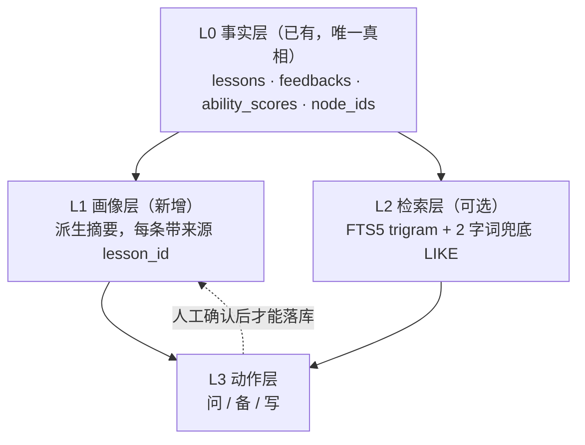

# 学生记忆与学生 Agent 方案（想法记录）

> 记录时间：2026-09-26。**状态：只是突发想法，未排期、未实施**（末尾有「待办记录」节）。
> 起因：用户提出「给每个学生分配一个 agent，后续与该学生有关的反馈内容可以直接问它；
> 或者以记忆的形式，把学生情况（反馈中呈现的）放在本地，后续可查询、可建议」。
> 文中标注了哪些事实是**本次实测核实过的**、哪些只是判断。

---

## 0. 一句话结论

**难的不是「agent」，是「记忆」。**
做这个功能的成败取决于三件事：记忆存什么、什么时候更新、怎么保证它不胡说。
「每个学生一个 agent」只是最后那个入口，不解决上面任何一件。

另外先纠一个概念陷阱：**「一个学生一个 agent 实例」技术上没必要**。
本质是「**一个 agent + 按 student_id 隔离的数据域**」。理由：

- 复用同一套提示词与工具，不必维护 N 份；
- 不会出现 N 份配置各自漂移；
- 权限边界靠 `student_id` 过滤即可，不需要多进程。

将来若真要做「每个学生性格不同」，也只是该学生的记忆里多一条 persona 描述而已。

---

## 1. 我们手里已经有的东西（比想象中好）

这一节决定技术选型，所以先摆清楚。

| 数据 | 现状 | 对记忆的价值 |
|---|---|---|
| `lessons` | 时间、时长、状态、主题、**知识点 node_ids** | 时间轴 + 知识点骨架 |
| `feedbacks` | 四段原文 **+ `doc`（整篇成品）** | `doc` 是**已经润色过的自然语言**，是喂模型的最好原料 |
| `ability_scores` | 维度 × 分数 × 时期 | 唯一**可量化**的趋势数据（雷达图的「变化」就靠它） |
| 知识树 / 题库 | 119 节点 + 题目 + 标签 | 能把「薄弱点」落到**具体题目**上 |
| `notes` | Markdown + 板书笔画 | ⚠️ **目前没有 `student_id`**，要纳入记忆得先加关联字段 |

**结论：不要一上来做向量库。** 一个老师几十个学生、每人几十到几百条反馈，这是小数据。
SQL 过滤 + 全文检索比 embedding 更**精确**、更便宜，而且不必拿学生的历史去换向量。

真正的瓶颈是「摘要质量」和「引用可追溯」，不是召回率。

---

## 2. 分层记忆模型



- **L0 事实层**：永不摘要，永远是唯一真相。agent 说的任何结论都必须能回溯到这里。
- **L1 画像层**：**80% 的价值在这里**。它不该是黑箱 —— 期望的形态：

```markdown
## 学习现状（截至 2026-09-26，基于最近 12 次课）
- 反复薄弱：内分点公式的比例对应（出现 3 次 → L7 / L9 / L11）
- 已经好转：符号运算（L2、L3 提到过，近 4 次未再出现）
## 未闭环的事
- L9 向家长承诺「下节课抽查错题本」 → L11 未提及
## 沟通偏好
- 家长关心书写规范与考试时间分配（L5、L11 的家长沟通稿）
```

注意每条后面的 `L7 / L9 / L11`：**能点开跳回那次反馈**。这一条是整个方案的基石。

- **L2 检索层**：见 §3，有实测结论。
- **L3 动作层**：见 §4。

---

## 3. 检索：本机能力实测（2026-09-26 核实）

**环境**：`backend/.venv` 的 SQLite **3.49.1**，编译选项含 `ENABLE_FTS3 / FTS4 / FTS5`。
→ **中文全文检索不需要引入向量库，也不需要新依赖。**

但有一个必须知道的坑，实测如下（`tokenize='trigram'`）：

| 查询 | 字数 | 结果 | 说明 |
|---|---|---|---|
| `内分点` | 3 | ✅ 命中 | |
| `段对应` / `线段对` | 3 | ✅ 命中 | 子串匹配可用 |
| `符号运算` | 4 | ✅ 命中 | |
| `线段` | 2 | ❌ **0 条**（库里明明有） | trigram 组不出 3 元组 |
| `粗心` | 2 | ❌ 0 条 | 同上 |
| `计算` | 2 | ❌ 0 条 | 同上 |
| `线段*` | 2+通配 | ❌ 0 条 | 通配救不回来 |
| `LIKE '%线段%'` | 2 | ✅ 1 条 | 兜底有效 |

对比 `tokenize='unicode61'`：`内分点`、`符号运算` 都 **0 条**（它按空格/标点切词，中文整段成一个 token）。

**结论**：用 `trigram`；**2 字关键词必须走 `LIKE '%xx%'` 兜底**，否则静默搜不到。
这个坑在本领域尤其要命 —— 「粗心」「计算」「公式」「线段」全是 2 字词。
好消息是数据量小（几百到几千行），`LIKE` 全表扫也是毫秒级，兜底完全没有性能顾虑。

**向量库 / embedding 暂不采用**，理由：
1. 数据量不匹配（这是小数据，精确匹配优于语义召回）；
2. 第三方 embedding = 把学生历史发出去换向量，与「数据存本机」直接冲突；
3. 本地跑 embedding 模型对 6GB 显存的机器是额外负担，而收益不确定。

---

## 4. 三个固定动作，而不是一个聊天框

老师要的不是聊天机器人，是三件具体的事。每个动作 = **固定模板 + 固定数据注入**，
比自由聊天**更好用、更便宜、也更安全**（自由聊天意味着不可预测地把多少数据发出去）。

| 动作 | 典型问题 | 数据注入 |
|---|---|---|
| **问**（诊断） | 他这学期哪块最弱？上次答应家长的事做了吗？ | 画像 + 命中检索 |
| **备**（备课） | 下节课讲什么？给个 20 分钟诊断方向 | 画像 + 最近 N 次 + 知识点树 |
| **写**（成文） | 家长沟通稿 / 学期总结 / 阶段报告 | 画像 + 指定时间范围 |

**本系统独有的杀手锏**：因为题库和知识树都在自己手里，可以做「**按他的薄弱点出 5 道题**」。
通用 AI 做不到，因为它不知道你手上有什么题。**这一环最该优先做。**

---

## 5. 隐私：三档，必须显式选

一个能跨年拼出某个学生完整画像的功能，恰恰是最不该「顺手」发到第三方的。

| 档位 | 说明 |
|---|---|
| **仅本机**（Ollama） | 唯一能保证一个字节都不出机器的选项。代价：6GB 显存跑 7B 偏紧、慢 |
| **脱敏后发** | 姓名 → 「该学生」，去掉联系方式 / 学校，只发结构化事实与摘要 |
| **原样发** | 每次明确告知「这次发了哪些内容」，并且**把画像本身也展示出来** |

沿用现有的「看看具体会发出去什么」预览（`FeedbackDialog` 里的 `willSend`），
但**必须把记忆内容也纳入那个预览** —— 否则老师不知道自己攒了一年的东西被发出去了多少。

---

## 6. 可核查性 > 聪明

最大的风险：一次「计算粗心」被反复引用，最后长成一个**永久标签**。

三条对策：

1. **强制溯源**：每句结论带 `lesson_id`，界面上可点开核对；
2. **区分语气**：明确标注哪些是「记录里写过」，哪些是「模型推断」；
3. **带时间与次数**：「出现 3 次，最近一次 L11」——而不是「这个学生粗心」。

同理，**agent 一律只建议、不自动写**：画像更新、学员记录修改都要人点确认
（沿用现在 AI 润色的「采用」模式）。它也**不该有写权限**。

---

## 7. 分期建议

| 期 | 内容 | 价值 |
|---|---|---|
| **A** | 学生画像：一键生成 → 存库 → 可编辑 → **带来源引用** | 80% 的价值，且立刻可核查 |
| **B** | 三个固定动作（问 / 备 / 写） | 日常真的会用得上 |
| **C** | 检索（trigram + 2 字兜底）+ **按薄弱点从题库出题** | 本系统独有优势 |
| **D** | 只读工具调用式 agent（让它自己决定查什么） | 更灵活，但多轮往返，成本与延迟都上去 |

对「写家长稿」这类一次性任务，**预先注入上下文比工具调用更划算** ——
工具调用的价值在开放式探索，不在固定动作。

---

## 8. 明确不建议做的

- ❌ 一上来做向量库 / embedding（数据量不匹配，且要拿学生历史去换）
- ❌ 每个学生一套独立 agent 配置 / 进程
- ❌ 让 agent 自动改学员数据、自动更新画像
- ❌ 做成通用聊天框（老师不会用，出了错也没法验证）
- ❌ 每次保存反馈就自动调 API 更新画像（既花钱又发数据）——
  应该是**提示「画像可能过时了，要更新吗」**

---

## 9. 待决策的问题（想用的时候再定）

1. **记忆形态**：可读可编辑的派生摘要（本文推荐）？还是坚持做原文向量库？
2. **模型档位**：允许第三方 API / 只要本机 / 两者可切？
3. **触发方式**：手动按钮，还是保存反馈后提示？
4. **范围**：只读问答，还是也要「按薄弱点出题」（会牵动题库）？
5. **笔记**：要不要纳入学生记忆？要的话得先给 `notes` 加 `student_id`。

---

## 附：一句话记法

> 先做**可读可编辑、带来源的画像**，别先做向量库；
> agent 只建议不写库；发出去之前必须让人看见发了什么。

---

## 待办记录（本次只记录想法，暂不实施）

记录时间 2026-09-26，状态：**未开始，也未排期**（用户原话：「只是突发的想法，不一定会使用」）。

- [ ] 若启动：从**阶段 A（学生画像）**开始，不做向量库
- [ ] 若真要做检索：先做 §3 的 `trigram` + 2 字 `LIKE` 兜底，**不要**跳过 2 字词测试
- [ ] 隐私档位（§5）必须在**动手前**定下来，因为它决定数据结构与接口形态
- [ ] 若纳入笔记：先给 `notes` 加 `student_id` 与迁移
